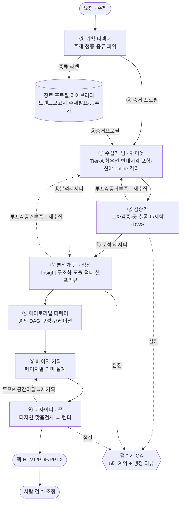

# TickDeck PRD v4.1 — 주제/요청 → 맞춤 프레젠테이션 자료 (장르 적응형 범용 하네스)

> 2026-06-28 작성(v4) → 같은 날 codex+제미나이 교차리뷰 반영(v4.1).
> v4 = 후추님 기본 틀을 **에이전트+스킬 하네스**로 재구축. 아키텍처·플로우 후추님 결재(6/28).
> v4.1 반영: ① 수집 장르-인지(증거 프로필 조기 적용) · 두 피드백 루프(재수집 / 페이지↔디자인) · 계약 구조화(JSON DAG·Insight 스키마) · 하이브리드 모델 라우팅. 빌드 게이트: 본부 → codex/제미나이 → 후추님 OK → 빌드.

## 0. 한 줄 정의
주제나 요청을 던지면, **자료 0에서 시작해** 요청에 맞는 장르의 **프레젠테이션 자료**(트렌드 보고서·주제 발표자료 등)를 만드는 **범용·재사용 에이전트 하네스**.

## 1. 왜 (실패 진단 — 반복 차단)
기존 `tickdeck_harness`는: 남의 완제품 보고서(Deloitte 등)를 **재포장**한 단일출처 덱(원본 분석 0) · 틀에서 **⑤⑥(렌더·디자인)부터 거꾸로** 짓고 ①수집·③분석을 비움 · 큐레이션을 `route→layout` **dict 매칭**(PRD 금지 안티패턴) · 검증 메타데이터("단일출처·강등")가 슬라이드 **내용**으로 노출 · 모아둔 자료·후추님 출처 우선순위를 무시.

## 2. v4가 못 박는 원칙
1. **범용·재사용** — 마케팅 한정 X. 1회성 X. 영구 시스템.
2. **장르 적응** — 요청을 읽고 *맞는 장르*로. "트렌드 보고서"는 한 프로필.
3. **자료 0 가정** — 수집을 1급 에이전트로.
4. **원본 분석 생산** — 어떤 장르든 *내가* 분석한 인사이트. 재포장 금지.
5. **분석=심장 / 디자인=마지막** — 디자인이 내용을 끌면 실패. (단 *공간 제약*은 페이지로 되돌림)
6. **척추 우선 설계** — 덱의 1급 구조는 *제목 시퀀스(척추)*다. **제목만 훑어도 전체 논증이 서야 하고(가로 흐름)**, 각 장 본문의 유일한 임무는 *바로 위 제목을 증명*하는 것(세로 흐름). 제목은 주어 있는 plain한 주장으로 **호명**한다(은유 조각·포맷명 X), 병렬 섹션은 **병렬 제목**, 닫음은 **결론→제언**. ④스토리·⑤페이지에서 척추를 *명시 산출물*로 설계·자가검사하고 C7로 게이트한다. (writing-standard B-5/6이 원리, 본 원칙이 그걸 1급 구조로 격상 + 압축 말투와 충돌 시 *가독성 우선* 타이브레이커.)

## 2.5 출처 우선순위 (후추님 명시 · 반복 유실 방지로 못 박음)
- **최우선(Tier-A)**: 컨설팅사(KPMG·PwC·Deloitte·McKinsey·BCG 등)·투자사·증권사 리서치 **PDF**. 정부/통계청(KOSIS·OECD) 1차.
- 보조: 협회·시장조사사·신뢰 언론(2차 인용 확인).
- ⚠️ **최우선 출처 ≠ 베낄 답.** 여러 개를 *교차*해 원본 분석을 만든다. 단일 보고서 결론부 복제 = 재포장 실패(C4 위반).

## 3. 사용자·성공 기준
사용자 = 후추님(customer zero). 성공 = 주제/요청 1개 → 장르에 맞는 **원본 분석이 담긴** 자료 초안, 사람 검수 최소.

## 4. 파이프라인 (후추님 6단계 + ⓪장르 + 2 피드백 루프 + QA)
```
[요청/주제]
 ⓪ 요청 해석            (기획 디렉터·opus)    → 주제·청중·종류(장르) + ⓐ증거 프로필 + ⓑ분석 레시피
 ──ⓐ 증거 프로필 적용──  (장르가 수집 안내)     → 어떤 종류 자료를(넓게+반대시각) Tier-A 우선 수집할지
 ① 데이터 수집          (수집가 팀·팬아웃)     → 증거 풀(강제 출처 스키마·Tier-A 최우선)
 ② 통합·검증            (검증가)              → 검증된 증거 풀  ┐
 ──ⓑ 분석 레시피 적용──  (장르별 렌즈·구성)      →               │ [루프 A] 데이터 결손/대거 강등 시
 ③ 분석 [심장]          (분석가 팀·토론)       → Insight[] (구조화)│  ②/③ → ① 재수집 트리거
 ④ 스토리              (에디토리얼·opus)      → 명제 DAG(JSON)    ┘
 ⑤ 페이지              (페이지 기획·opus)      → 페이지 플랜  ┐ [루프 B] 공간 미달(과밀/잘림) 시
 ⑥ 디자인/렌더 [끝]     (디자이너)             → 맞춤검사→렌더 ┘  ⑥ → ⑤ 분할/요약/재기획
 ── 가로질러 QA        (검수가·opus)          → 5대 계약 위반 스캔 + 비저자 냉정 리뷰(모듈마다 점진)
 → 사람 검수·조정
```
- **루프 A (수집 보강)**: 검증/분석에서 증거 부족·신뢰 미달이면 후반 억지 짜내기(=재포장)로 가지 말고 ①로 돌아가 추가 수집.
- **루프 B (페이지↔디자인)**: 디자이너가 page-plan을 받아 **디자인-맞춤검사**(공간/밀도) → 미달이면 ⑤로 되돌려 분할·요약·재기획 후 렌더. *공간 제약만* 되돌림(디자인이 내용을 끌지 않음).

## 4.1 순서도 (Mermaid)


## 5. 에이전트 로스터 (`.claude/agents/`) — 하이브리드 모델
| 파일 | 역할 | 모델 | 핵심 책임 |
|---|---|---|---|
| `intake-director` | 기획 디렉터 | opus | 장르·청중·깊이 판별, ⓐ증거 프로필 + ⓑ분석 레시피 산출 |
| `collector` | 수집가(팬아웃 N) | 가벼운+코드 | Tier-A(컨설팅·투자·증권 PDF) 최우선·반대시각 포함 raw 수집. 신야 :online 경유. 강제 스키마 반환 |
| `verifier` | 검증가 | 코드+가벼운 | DWS·중복·좀비/세탁/순환=코드, 교차판단부만 모델 |
| `analyst` | 분석가(팀·토론) | opus | 장르 렌즈로 **Insight[] 구조화** 도출(아래 7절). 적대 셀프리뷰 |
| `editorial-director` | 에디터 | opus | 관통 명제 + **명제 DAG(JSON)**. 큐레이션=서사 판단(dict X) |
| `page-planner` | 페이지 기획 | opus | 페이지별 의미 설계(형식 아닌 의미). 루프B 재기획 수용 |
| `designer` | 디자이너/렌더러 | 가벼운+코드 | 디자인-맞춤검사(공간/밀도 코드) → 양식·팔레트·**viz 블록**(차트 6종: before_after·dumbbell·flow·big_number·gap_map·shift — `series`는 metric_id로만·차트당 핵심 2~3개)·렌더 (맨 마지막) |
| `qa-reviewer` | 검수가 | opus(general-purpose) | 5대 계약 위반 스캔 + 비저자 냉정 리뷰 |

**품질 게이트(안전장치):** 가벼운 모델 단계의 산출이 다음 단계 입력 계약을 미달하면 **opus로 자동 승격** 후 재수행. (후추님 "품질 안 떨어지면 하이브리드 ㄱㄱ" 조건 충족 장치)

## 6. 장르 프로필 (`.claude/skills/` · 종류별 레시피 · 확장)
= **출력물 종류별 레시피.** ⓪에서 종류 판별 시 둘로 갈라 산출:
- **ⓐ 증거 프로필** — *수집*을 안내(어떤 종류 자료를 Tier-A 우선·넓게·반대시각 포함). **①수집부터 적용**(종류 모르고 일반 검색만 긁으면 ③에 쓸 게 없음 — codex/제미나이 지적).
- **ⓑ 분석 레시피** — *분석·구성* 방법(렌즈·명제 틀·페이지 관습). **②검증 뒤 ③분석부터 적용**(검증된 자료 위에 얹음).
- ⚠️ 둘 다 "무엇을 모으고 어떻게 분석할지(범위·방법)"지 "어떤 결론을 낼지"가 아님 → 편견 차단.

프로필 예: `genre-trend-report`(렌즈 10종·트렌드=상태전이) / `genre-topic-deck`(주제 구조화·핵심논점) / 확장 = 스킬 1개 추가(시스템 재구축 X).

## 7. 계약 C1~C7 (구조화 산출물로 강제 — 텍스트 검사 X)
핵심: 텍스트만 보면 판정이 흔들린다(flaky). 그래서 **구조화 출력**을 강제하고 그 구조를 검증한다.

**Insight 스키마 (③분석 산출 단위):**
`{ claim, evidence_ids[](≥2), derivation_type, counter_signal, narrative_reason, source_overlap_score, [트렌드 장르 시] from_state·to_state·mechanism }`

| # | 계약 | 강제 방법 (test 장치) |
|---|---|---|
| C1 | 큐레이션 dict-매칭 금지 | ④가 **명제 DAG(JSON)** 출력 → 모든 페이지 명제가 상위 명제에 연결. 고아 노드/"route=X 전부 모음" 섹션 = 실패 |
| C2 | 검증 메타데이터 콘텐츠 노출 금지 | 출력 제목/본문에 "단일출처·정성근거·강등·신뢰도" 류 표현 0 (스캔) |
| C3 | 트렌드=방향(정적 통계 헤드라인 금지) | 트렌드 장르 헤드라인 Insight는 `from_state·to_state·mechanism` 필수(상태 전이 스키마). 단순 수치=불가 |
| C4 | 원본 분석 생산(재포장 금지) | **Citation Tracker**: Insight의 `evidence_ids≥2` & `source_overlap_score`로 서로 다른 Source ID 융합 검증. 자가 태그만 = 실패 |
| C5 | 디자인-우선 금지(순서 강제) | designer는 page-plan 받고서야 가동. 루프B는 *공간 제약*만 ⑤로 되돌림 |
| C6 | 렌더 콘텐츠 권한(날조 차단) | 렌더 HTML의 모든 수치·출처는 registry(metric_id/src_id) 주입만 — designer가 raw 숫자·출처 라벨 직접 작성 금지. **viz 블록**(차트)도 `series[].metric_id`로만 수치 표시. 단 제목·헤드라인·표지 lockup의 연도·순번 등 *서사 숫자*는 예외(본문 통계는 엄격). 강제 = render 전 deck_spec C6 게이트 + `validate_c6_content_authority`(렌더 HTML 스캔) |
| C7 | 제목 척추 가독성(원칙 6) | qa-reviewer가 **제목(short_title)만 순서대로 추출**해 본문 가리고 논증을 재구성 → ① 흐름이 끊기거나 ② 주어 없는 은유 조각("균형추")·포맷명("~매트릭스")·정체불명 압축("유동적 측정 기준")이 있으면 실패. ③ 병렬 섹션이 병렬 제목이 아니거나 ④ 닫음이 결론→제언으로 안 닫히면 감점. helper `spine_check.py`로 척추 추출(스캔은 기계, 논증 성립 판정은 opus). |

## 8. 실행 모드 (하이브리드)
수집 팬아웃(서브·가벼운) → 검증(코드+가벼운) → 분석 팀(opus·토론) → 스토리·페이지(opus) → 디자인(가벼운+코드) → QA(opus·점진). 오케스트레이터가 조율(파일 기반 `_workspace/` 산출물 + 태스크/메시지). 두 피드백 루프 포함.

## 9. 비기능
- **보안**: 중국 모델 호출은 신야 격리 경유만. TickDeck는 자료만 소비.
- **진실**: 모든 수치/주장에 출처·한계 강결합(CED·Insight 스키마). 큐레이션·렌더까지 출처 유지.
- **비용**: 하이브리드 라우팅으로 토큰·지연 절감. 무거운 디깅은 분산(신야). 렌더 0(로컬).

## 10. 단계별 acceptance 게이트
각 단계 산출이 다음 입력 계약 만족해야 진행. 미달 = 1회 재시도/모델 승격 → 그래도 미달이면 누락 명시하고 진행(상충 데이터 삭제 X·출처 병기). 데이터 결손은 루프 A로 재수집.

## 11. 안티패턴 (절대 금지)
디자인-우선 ❌ · dict 매칭 큐레이션 ❌ · 검증메타 콘텐츠화 ❌ · 정적 통계를 트렌드로 ❌ · 단일출처 재포장 ❌ · 일회용 드라이버 ❌ · 텍스트 fallback ❌ · 단방향(피드백 루프 없음) ❌ · **제목 은유 조각/포맷명/척추 끊김 ❌**(원칙 6·C7)

## 12. 은퇴
`tickdeck_harness/`(파이썬) = v4 완성 후 은퇴·status 도장. `knowledge/`(흡수 캐논)는 장르 프로필 스킬의 참조 자료로 이관.

## 13. 리뷰 반영 이력
| 날짜 | 항목 | 출처 |
|---|---|---|
| 2026-06-28 | 증거 프로필 ⓐ 조기 적용(수집 장르-인지) + Tier-A 출처 우선순위 | codex·제미나이·후추님 |
| 2026-06-28 | 피드백 루프 A(재수집)·B(페이지↔디자인) 추가 | codex·제미나이 |
| 2026-06-28 | C1/C3/C4 구조화(명제 DAG·상태전이·Insight 스키마+Citation Tracker) | codex·제미나이 |
| 2026-06-28 | 하이브리드 모델 라우팅 + 품질 게이트 | codex·제미나이·후추님(품질 조건부) |
| 2026-06-29 | C6 렌더 권한 계약 명문화 + viz 블록 6종(designer→render_deck SVG·registry 주입)·제목 연도 C6 예외·PDF `@page`(--headless=new) 캡처·일회용 드라이버 은퇴 | 클차장(구현 선행분 PRD 반영)·codex 빌드·Workflow 적대검증 |
| 2026-06-30 | **원칙 6 척추 우선 설계 + 계약 C7 제목 척추 가독성** 신설. 실 청중 피드백("제목만 읽으면 흐름이 안 이어지고 무슨 말인지 모름")이 근본 원인 노출 — writing-standard에 원리는 있었으나(B-5/6) ① 압축 말투와 충돌 ② enforcement 부재. page-planner(척추 산출물)·qa-reviewer(C7 게이트)·writing-standard(가독성 타이브레이커)·genre-trend-report(병렬 명명·결론→제언)에 정합. | 후추님(실청중 피드백·"한 단계 업그레이드")·딜로이트 Tech Trends 2026 제목 흐름 흡수 |

## 14. 빌드 후 결정된 기본값 (v4.1 빌드 cross-check·클차장 결정)
코덱스 빌드가 PRD에 안 정해져 '미정'으로 남긴 것을 클차장이 결정(유실 방지로 기록):
- **모델 매핑**: opus = intake-director·analyst·editorial-director·page-planner·qa-reviewer / **sonnet** = collector·verifier·designer(가벼운 단계). 품질 게이트로 미달 시 opus 승격. 후추님 "품질 안 떨어지면" 조건 → 첫 실주행에서 품질 모니터(필요 시 opus 상향 or haiku 하향).
- **C4 `source_overlap_score` 임계값 = 0.85** (>0.85 = 단일출처 과의존 판정·재포장 차단). 데이터 쌓이면 튜닝.
- **`_workspace/<run_id>/`** run_id = `YYYYMMDD_HHmm_<주제슬러그>`. **기본 render target = HTML**(최저비용·웹 확인). PDF/PPTX는 요청 시.
- 외부 교차리뷰(Gemini CLI)는 빌드 중 타임아웃(exit 130)으로 미완 — 필요 시 후속.
