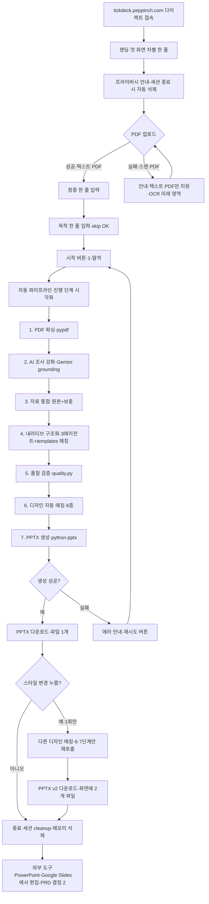

# TickDeck v2 — 유저 플로우

## 메타
- 기준 PRD: `TickDeck/v2/PRD_v2.md`
- 작성일: 2026-05-12
- Phase: 5 (SaaS Builder 청사진)·5/13 7단계 중 1번 살짝 진행

## 페르소나 (1명·PRD 명시)

### P-1 자료 만들기 일반인
- 영역: 학생·직장인·소상공인·1인 사업자·자료 만들기 자주 X
- 목표: 손에 있는 PDF (참고 자료·리서치 등) → 그럴싸한 PPTX 1-딸깍
- 진입점: 페핀치 진열대 (peppinch.com) → tickdeck 링크 또는 다이렉트 URL
- 익숙도: PowerPoint·Google Slides 기본·디자인 X·옵션 多 자국

⚠️ 후추님 본인 같은 power user는 v0 영역 X (PRD line 13 명시).

## 핵심 여정 (Mermaid)

## 분기·이탈 영역

| 단계 | 이탈 위험 | 대응 |
|---|---|---|
| 랜딩 | "AI PPT 또 그거?" 의심·차별 안 보임 | 차별 한 줄: 일반인 1-딸깍 + 후추님 PDF 자산 매칭 |
| 프라이버시 안내 | 클라우드 저장 자국 | 세션 종료 시 자동 삭제·DB X·계정 X 명시 |
| PDF 업로드 | 스캔 PDF 자국 | 안내·텍스트 PDF만 지원·OCR은 미래 영역 |
| 청중·목적 입력 | 한 줄 답 모름 | placeholder 예시·skip 영역 (default 적용) |
| 자동 파이프라인 (1~5분) | 기다림 지루·실패 자국 | 진행 단계 시각화·메시지·재시도 영역 (PRD line 224~231) |
| PPTX 다운로드 | 결과물 자국 | 즉시 다운로드·외부 도구 (PPT·Google Slides) 편집 안내 |
| 스타일 변경 | 다른 디자인 자국 | 1회만·원본 보존·파일 2개 영역 (PRD 결정 8) |

## 모바일 vs 데스크탑

- Streamlit 기본 = 데스크탑 우선
- 모바일 동작 OK (Streamlit responsive)·단 PDF 업로드·PPTX 다운로드 영역 = 데스크탑 사용감 ↑
- 안내: 첫 화면에 "데스크탑 권장" 한 줄
- 모바일 사용자 = 시작은 OK·결과물 (PPTX 편집) 영역에서 데스크탑 자연

## 클차장 자율 결정 (PRD 추출 정합)

PRD가 답 줘서 후추님 추가 질문 X 영역:

| 영역 | PRD 답 |
|---|---|
| 페르소나 1명 vs 3명 | 1명 (일반인) — PRD line 13 |
| 진입점 우선 | tickdeck.peppinch.com 다이렉트 — PRD line 83 |
| 이탈 영역 | PRD line 222~232 에러 핸들링 영역 정합 |
| A/B 분기 | 스타일 변경 1회 (사용 후 분기) — PRD 결정 8 |
| 모바일·데스크탑 | 같은 흐름·데스크탑 권장 안내 (Streamlit 결) |

## 다음 단계 (PRD 5/13 7단계 중)

- ✅ 1단계: user_flow.md (본 문서·5/12 살짝 진행)
- ⏳ 2단계: UI 시안 wireframe (1시간·skill X·HTML 또는 Figma)
- ⏳ 3단계: feature-spec:index (30분)
- ⏳ 4단계: pm-execution:test-scenarios (30분)
- ⏳ 5단계: pm-execution:pre-mortem (30분)
- ⏳ 6단계: superpowers:writing-plans (1시간)
- ⏳ 7단계: 노클 PDF 송부 받고 본진+제대리 교차 분석 (자동·1~2일)

## 본진 룰 정합

- 한국어 우선·Mermaid·표준 띄어쓰기
- 후추님 추가 인터뷰 X·PRD 자동 추출만으로 충분 (살짝 진행 톤 정합)
- 디자인 시스템 정합 = 6종 (Minimal White·Soft Coral·Dark Mode·Deep Blue Pro·비즈니스 정장·콘텐츠 컬러풀)
