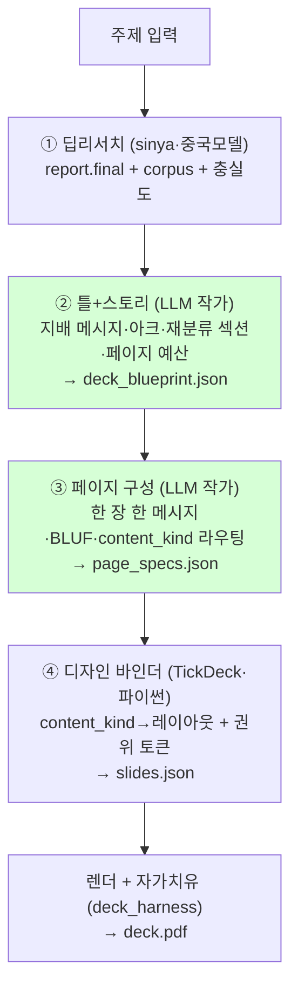

# TickDeck v3 — ②③ 발표 작가 단계 설계 (구현용 명세 = 코과장 시동 메모)

> 2026-06-19 · 클차장 설계(C레벨). 구현 = 코과장(Codex). 근거 = `DECK_STRUCTURE_LIBRARY.md`(역분석 학습본) + 파이프라인 입출력 계약 매핑(Explore).
> 한 줄 진단: 지금 엔진은 **작가 없이 슬라이서만 있다.** 보고서 마크다운을 기계적으로 잘라 채우니 지배 메시지·스토리·결론-먼저가 없다. 이걸 **LLM이 작가, 파이썬이 렌더**로 가른다.

## ⚠️ 2026-06-19 결정 — 작가는 클로드 (중국모델 아님)

후추님 PD 캐스팅 교정: **②③ 작가 = 클로드.** 중국 AI는 ① 취재(사실 수집)에만. 작가 역할은 취향·편집 판단 + 우리 플레이북(구조 라이브러리·후추님 덱 방법론)이 있어야 함 → 클로드 강점. 비용/자동화/격리/단일의존 어느 것도 ②③을 중국모델로 둘 근거가 못 됨(②③은 덱당 2회 호출이라 싸다).

두 차수:
- **현 차수 (B) = 인세션 클차장이 직접 작가.** result(①리서치) 읽고 클차장이 **`page_specs.json`을 손으로 써서** 바인더에 먹인다. 자동 author 모듈 호출 X. 목적 = 프롬프트·플레이북 캘리브레이션.
- **상용화 차수 (A) = 자동 클로드 API 스테이지** (`anthropic_call_wrapper`, 시스템 프롬프트 = 구조 라이브러리). 검증된 (B) 플레이북을 굳혀 핸즈오프 범용화.

→ `deck_author.py`(현재 코덱스가 중국모델로 짠 자동 모듈)는 **(A) 자리의 스캐폴드로 파킹** — 지금 기본 경로 아님. (A) 갈 때 LLM 클라이언트만 OpenRouter→`anthropic_call_wrapper`로 교체. 현 차수 기본 경로 = **명시 `page_specs.json` 입력**(author 호출 건너뜀).

## 0. 정본 FLOW (교정본)



**핵심 가름:** ②③ = 판단·서사·재분류 → **LLM(작가)**. ④ = 결정적 매핑·필드 채움 → **파이썬(렌더)**. 기존 `axis1_to_deck.py`의 "마크다운 파싱+슬라이스"는 **사라지고**, "page_specs → 레이아웃 바인딩"으로 대체된다.

## 1. 어디서 도느냐 (작가·모델 — 6/19 결정 반영)

- **현 차수 (B):** 작가 = 인세션 클차장. ②blueprint·③page_specs를 클차장이 **손으로 작성**(본 문서 §2·§3 스키마 그대로). LLM 자동 호출 없음. 산출 = `page_specs.json`(필요 시 `deck_blueprint.json`도 메모로).
- **상용화 차수 (A):** 자동 클로드 API 스테이지. `Think/.claude/scripts/anthropic_call_wrapper.py` 경유, 시스템 프롬프트 = 구조 라이브러리 §1·§2 법칙. ②→③ 2회 호출. 모델 교체 가능 인터페이스(클로드 기본).
- `deck_author.py` = (A)의 스캐폴드(현재 OpenRouter 중국모델 placeholder). **현 차수에선 호출 X·파킹.** (A) 전환 시 LLM 클라이언트만 `anthropic_call_wrapper`로 교체(스키마·프롬프트는 모델 무관).
- 중국모델은 ① 취재 한 군데만(공개 웹 자료·sinya 격리). 작가 단계엔 중국모델 X.

## 2. ② 틀+스토리 — `deck_blueprint.json`

LLM이 **report.final 전체**를 읽고 덱의 골격을 짠다. `DECK_STRUCTURE_LIBRARY.md §1` 법칙을 프롬프트에 그대로 싣는다.

### 출력 스키마
```json
{
  "topic": "원 주제 문자열",
  "governing_thought": "덱 전체가 증명할 단 하나의 문장 (지배 메시지)",
  "governing_thought_short": "표지·결론에 반복할 짧은 버전(수미상관)",
  "story_arc": ["현재 …", "전개 …", "결론 …"],
  "audience": "이 덱을 보는 사람(추정)",
  "sections": [
    {
      "id": "S1",
      "theme_title": "우리 렌즈로 재범주화한 테마명(명사구 또는 질문형)",
      "theme_slogan_en": "목차 미리노출용 영문 슬로건",
      "governing_subpoint": "이 섹션이 지배 메시지를 떠받치는 한 줄",
      "original_categories": ["원 보고서 어느 섹션/항목에서 왔는가"],
      "reclassified": true,
      "page_budget": 3,
      "key_points": ["이 섹션에서 다룰 핵심 3~6개"]
    }
  ],
  "reclassification_note": "원분류 → 재분류 근거 한 줄(각주용)"
}
```

### ② 프롬프트 법칙 (구조 라이브러리 §1 이식)
- **지배 메시지 1줄을 먼저 정하라.** 모든 섹션은 이 문장을 증명해야 한다.
- **스토리 아크**: 현재→전개→결론(또는 문제→진단→해법→증명→실행) 중 자료에 맞는 형 1개.
- **재분류가 차별의 핵심**: 원 보고서 항목을 그대로 베끼지 말고 "우리 렌즈"로 5±2 테마로 재범주화. `original_categories`에 출처를 남겨 *해석한 것*임을 못 박는다.
- 성숙도/근거량 낮은 테마는 `page_budget` 줄인다.
- 주제가 사람·역사·개념이면(예: "홍대용") 시장 프레임 강요 X — 자료 모양에 맞춘 테마(생애·사상·의의 등).

## 3. ③ 페이지 구성 — `page_specs.json`

blueprint + report 전체를 주고, **페이지마다 한 메시지**로 구성. `§2` + `§2★ 라우팅 표` 이식.

### 출력 스키마
```json
{
  "topic": "...",
  "governing_thought_short": "...",
  "pages": [
    {
      "page_no": 1,
      "role": "cover|agenda|section_divider|content|section_synthesis|conclusion|references",
      "section_id": "S1",
      "section_nav": "1-2 테마명 (2/4)",
      "headline": "명사구 또는 질문형 제목(한 장 한 메시지)",
      "takeaways": ["BLUF 결론 불릿 2~4개 — 페이지 결론을 먼저"],
      "content_kind": "market_numbers|institution_forecasts|comparison|timeline_evolution|concept_relation|funnel_steps|growth_drivers|implications|narrative",
      "payload": { "스키마는 content_kind별로 §3.2 참고": true },
      "sources": [{"name": "기관/저자", "url": "..."}],
      "footnotes": [{"term": "SDV", "en": "Software Defined Vehicle", "def": "..."}]
    }
  ],
  "references": [{"name": "...", "url": "...", "tag": "본문 출처|수치 근거|용어 근거"}]
}
```

### 3.2 content_kind별 payload (LLM이 보고서에서 추려 구조화)
| content_kind | payload 형태 |
|---|---|
| market_numbers | `{stats:[{label,value,note,source}]}` |
| institution_forecasts / comparison | `{headers:[...], rows:[[...]], source}` (표 — 원본 표를 다시 그린다) |
| timeline_evolution | `{stages:[{period,label,detail}]}` |
| concept_relation | `{before:{title,items[]}, after:{title,items[]}, metric?}` |
| funnel_steps | `{steps:[{label,body}]}` |
| growth_drivers | `{cards:[{title,body}]}` |
| implications / narrative | `{paragraphs:[...]}` |

### ③ 프롬프트 법칙 (§2 이식)
- **헤드라인 = 명사구 또는 질문형.** 본문 문장을 잘라 제목으로 쓰지 마라(현재 결함 1).
- **결론 먼저(BLUF)**: `takeaways`에 그 페이지 결론을 2~4개로 먼저. 그 다음 근거(payload).
- **한 장 한 메시지.** 한 페이지에 두 주제 섞지 마라.
- **content_kind를 데이터 모양 보고 골라라**(라우팅 표). 미래·관계는 글이 아니라 도식/타임라인. "불릿로 다 채우기" 금지.
- 표는 원본 표를 **다시 그려** payload에 넣고 `source`를 단다(표 안에 출처 욱여넣기 X — 현재 결함 4·표 출처는 하단).
- subtitle 자리에 한자·영어·각주 뒤섞인 빽빽한 문장 금지(현재 결함 2). 용어 병기·각주는 `footnotes`로.
- 첫 페이지 role=cover, 둘째 role=agenda(테마 영문 슬로건 미리노출), 섹션마다 section_divider 1장, 큰 섹션 끝에 section_synthesis 1장 권장, 맨 끝 references 1장.
- 목차(agenda)에는 **테마 제목만**. 본문 문장·인용 덤프 금지(현재 결함 3).

## 4. ④ 디자인 바인더 — `axis1_to_deck.py` 재작성

기존 "마크다운 파싱+슬라이스" 제거. **page_specs.json을 받아 레이아웃에 바인딩**한다.

### content_kind/role → deck_harness 레이아웃 (manifest.json 재작성)
| role/content_kind | layout |
|---|---|
| cover | `cover_hero` |
| agenda | `editorial_impact_axes` |
| section_divider | `section_divider_hero_text` |
| market_numbers | `data_visualization_3col_chart` ↔ `data_visualization_2col_chart_text` |
| institution_forecasts / comparison(표) | `requirements_excel_table` ↔ `tam_scenario_table` |
| timeline_evolution | `contest_history_timeline_bullet` ↔ `ir_company_overview_timeline_milestone` |
| concept_relation | `before_after_diagram_with_metric` |
| funnel_steps | `funnel` |
| growth_drivers | `3-card` |
| implications / narrative / conclusion / section_synthesis | `narrative_centered_text_block` (또는 `closing`) |
| references | `references_notes` |

같은 content_kind에 후보가 2개면 인덱스로 로테이션(같은 유형 반복 시 단조로움 방지).

### 권위 토큰 채움 (§3 — 전 페이지 강제)
- 모든 content 페이지 하단 **출처 한 줄**(`자료: …`) ← page.sources.
- `footnotes` → 용어 영어 병기/번호 각주.
- 헤드라인 위 **섹션 네비 태그**(eyebrow = page.section_nav).
- 표 슬라이드: 출처는 표 하단 `source`/`caption`에만(행에 X).
- 맨 끝 references_notes = page_specs.references 리스트.

## 5. 시동 메모 6항목

> **6/19 진행 상태:** 코덱스가 `axis1_to_deck.py`를 page_specs→slides **바인더로 재작성 완료**(validate_page_specs·load_page_specs·bind_*·build_deck), manifest 라우팅, deck_author.py 스캐폴드까지 지음. **남은 것 = `build_and_render`가 명시 `page_specs.json`을 받아 자동 author 호출을 건너뛰는 (B) 진입점 마무리 + 깨진 테스트 2개 통과.** 아래 표는 (A) 포함 전체 그림 보존용.

| 항목 | 내용 |
|---|---|
| 목표 | ①리서치 결과 → ②blueprint → ③page_specs → ④바인딩 → 렌더가 한 흐름으로 돌아, 어떤 주제 텍스트든 *발표 작가가 쓴* 덱이 나온다. |
| 하지 말 것 | deck_harness 렌더 코드 수정 X(레이아웃 그릇은 그대로). 중국모델을 sinya 밖에서 호출 X. report 본문을 기계적으로 잘라 제목/subtitle에 넣는 옛 경로 부활 X. 꾸며내기 X(payload는 report에서만). |
| 읽을 파일 | `TickDeck/v3/AUTHOR_STAGE_DESIGN.md`(본 문서)·`DECK_STRUCTURE_LIBRARY.md`·`sinya/experiments/deepresearch/runner.py`(OpenRouter 클라이언트·result JSON 구조)·`TickDeck/v3/pipeline/axis1_to_deck.py`·`build_deck.py`·`axis2_layouts/components/manifest.json`·deck_harness 레이아웃 필드(Think/tools/deck_harness/src/build.py) |
| 수정 가능 범위 | 신규 `sinya/experiments/deepresearch/deck_author.py`. 재작성 `TickDeck/v3/pipeline/axis1_to_deck.py`(바인더화). 재작성 `axis2_layouts/components/manifest.json`(위 라우팅). `build_deck.py`는 page_specs 경유하도록 입력부만 수정. |
| 완료 기준 | (a) `deck_author.py`가 result JSON → `deck_blueprint.json` + `page_specs.json` 생성 (b) `axis1_to_deck.py`가 page_specs → slides.json 바인딩 (c) 마케팅 + 홍대용 두 리포트로 끝까지 빌드 → 렌더 hard issue 0 (d) 결과 덱에 지배 메시지(표지·결론 반복)·목차(테마만)·BLUF·재분류 섹션·표 원형 보존·하단 출처가 실제로 들어감 |
| 검증/보고 형식 | 단위테스트 통과 + 두 덱 build_deck 후 final_hard_issues 0 + 바뀐 파일·함수 목록 + 예시(생성된 governing_thought 1개·page_specs 페이지 2개·바인딩된 slides 2개) 보고. 끝나면 **에이전트 소환해 코드 리뷰**(후추님 지시). |

## 6. 위험·정직
- ③ 단일 LLM 호출이 긴 report에서 토큰 초과 가능 → 1차는 단일, 초과 시 섹션 분할 폴백.
- 작가 품질 = 프롬프트 의존. 프롬프트가 §1·§2 법칙을 못 실으면 옛 결함 재발. 첫 렌더 후 실물 보고 프롬프트 보강(②③은 프롬프트가 곧 설계).
- ④ 라우팅이 빈약하면(§4 표) "글 슬라이드만 반복" → manifest 후보 2개 로테이션으로 1차 완화. 신규 레이아웃(N단계 진화 타임라인·생태계도)은 첫 렌더 약점 보고 다음 차수.
