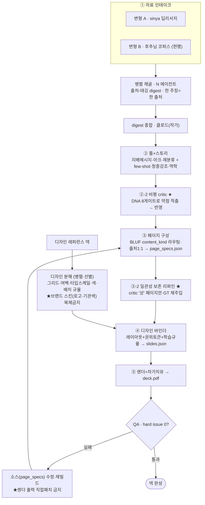

# TickDeck 덱 제작 시스템 — 현행 FLOW 정본 (운영 런북)

> 2026-06-24 · "보강 flow"를 실제 운영으로 시스템화. **이 문서 = 어떻게 돌리나(런북).**
> SoT 분담: 작가 DNA = `DECK_STRUCTURE_LIBRARY.md` · ②③ 상세설계 = `AUTHOR_STAGE_DESIGN.md` · **운영 = 본 문서.**
> 기원: Kimi 제작-flow 흡수(②-2 비평 · few-shot · 청중강조 · 프롬프트역학 · QA 소스수정) + 후추님 코퍼스 인테이크 변형. 검증 차수 = 2026 마케팅 덱 재제작으로 첫 완주 중.

## 0. 한 줄 + 언제 쓰나
- **한 줄** = 자료(코퍼스/딥리서치) → 작가 엔진(②③) → 비평·리파인 → 디자인 바인딩 → 렌더. 결과 = **후추님 보이스의 설득 덱**.
- **변형 A** = ① 딥리서치(sinya 격리·중국모델). **변형 B (현행)** = ① 후추님이 코퍼스 직접 제공 → 중국모델 의존 제거.

## 1. 정본 FLOW

## 2. 단계별 시스템

| 단계 | 입력 | 처리 (주체) | 출력 | 게이트 |
|---|---|---|---|---|
| ① 인테이크 | 주제 | 코퍼스 수집(후추님) or 딥리서치(sinya) | 원자료 PDF/JSON | — |
| 채굴 | 원자료 | **병렬 에이전트** | `intake/content_*.md` | 출처 1:1 |
| 디자인 학습 | 레퍼런스 덱 | **병렬 에이전트(선별)** | `intake/design_*.md` | 스킨 복제금지 |
| 종합 | digests | **클로드(작가)** | 지배메시지·아크 | 수렴 신호 검증 |
| ② 틀+스토리 | 종합 | 클로드 | `deck_blueprint`(메모) | 재분류 명시 |
| ②-2 비평 ★ | blueprint/specs | critic LLM | 약점 리스트 | DNA 8게이트 |
| ③ 페이지 | blueprint+자료 | 클로드 | `page_specs.json` | 한장한메시지·출처1:1 |
| ③-2 리파인 ★ | critic 지적 | 클로드 | 보강 page_specs | GT 일관성 |
| ④ 바인더 | page_specs | 파이썬 | `slides.json` | 권위토큰 강제 |
| ⑤ 렌더 | slides | deck_harness | `deck.pdf` | hard issue 0 |

## 3. ① 병렬 채굴 (변형 B 현행 방법)

- 코퍼스를 **N 에이전트로 분배** — 페이지 부하 균형(예: 14 PDF·~600p → 내용 5 + 디자인 3 = 8 에이전트). 92p·65p 같은 대형은 단독 배정.
- 각 에이전트: 출처-태깅 digest를 `intake/content_*.md`에 **파일로 저장**, 요약만 반환 → 합성 컨텍스트 보존.
- **엄수 규칙**(= 옛 'p9 출처 샐러드' 결함 차단):
  - 실재 사실만 · 추측/창작 금지 · 없는 숫자 금지
  - **한 주장 = 한 출처 + p.N** (여러 기관을 한 숫자 뒤에 묶지 마라)
  - 우선순위: 정량 통계/전망 · 이름붙은 트렌드 · before→after · 프레임워크/분류 · 강한 인용
  - 보고서 **자체 thesis** 1줄 기록(재분류 연결고리용)
- 재사용 프롬프트 = §6.A.

## 3D. 디자인 학습 패스 (병렬·선별)

- 고품질 레퍼런스 덱을 분해 → **그리드·여백·타입스케일·색·배치 '규율'만** 흡수. ⚠️ 브랜드 스킨(로고·기관 고유색)은 [복제금지].
- 전 자료 강제 X — **디자인적으로 두드러진 것만 선별**("습득할만한건"). 지정 레퍼런스는 깊게, 나머지는 스윕.
- 산출 `intake/design_*.md` → `DECK_STRUCTURE_LIBRARY.md` "④ 디자인 벤치마크"에 규율로 입힘.
- 재사용 프롬프트 = §6.B.

## 4. 작가 단계 (②→②-2→③→③-2)

- **② 틀+스토리**: 지배메시지 1줄(표지·결론 수미상관) + 스토리 아크 + **5±2 재분류 섹션**(원분류 병기) + 페이지 예산. 프롬프트에 **few-shot 골드예시**(critic-클린 페이지) 동봉 · **청중 강조점만** 조절(보이스는 후추님 고정 = E절충) · 프롬프트 역학(구분자·시작끝 반복·JSON 프라이밍 = C).
- **②-2 비평 critic ★**: DNA 8게이트로 논리·출처·착지 약점 적출 → 작가 반영. 도구 = `v3/review/run_critic_pass.py`.
- **③ 페이지 구성**: 한 장 한 메시지 · BLUF(결론 먼저) · content_kind 라우팅 · **출처 1:1** → `page_specs.json`.
- **③-2 일관성 보존 리파인 ★**: critic '치명도 상' 페이지**만** 선별 · governing_thought 재주입 · 1:1 보강. **무차별 전체 재생성 금지**(일관성 파괴 방지).

## 5. 디자인·렌더 (④→⑤→QA)

- **④ 바인더**: content_kind/role → deck_harness 레이아웃 + 권위토큰(출처줄·각주·푸터·섹션네비) + **학습한 디자인 규율** → `slides.json`.
- **⑤ 렌더+자가치유**: ECharts·python-pptx → `deck.pdf`.
- **QA 게이트**: hard issue 0? 실패 → **소스(page_specs) 수정·재빌드**. ★렌더 출력(pdf) 직접 패치 금지 — 결함은 항상 소스에서 고친다.

## 5.5 리뷰 분담 (빌드·렌더 後 · 후추님 2026-06-24)

| 검수 영역 | 담당 |
|---|---|
| 사실 확인 (수치·출처 정확성) | **Codex + Gemini** |
| 구성 (논리·아크·재분류·BLUF) | **Codex + Gemini** |
| 디자인·배치 (그리드·여백·타입·색·레이아웃) | **Codex + Gemini** |
| 한글 맞춤법·문법 | **Claude 국어학 교수 에이전트(신규 생성)** |

- critic(②-2 DNA 8게이트) = 빌드 前 자가검증 / 본 표 = 빌드·렌더 後 외부 리뷰.
- 한글 교수 에이전트 = 맞춤법·띄어쓰기·문법·번역체·CJK 혼용 검출 + 자연 한국어 교정 (§3D 한국어 자연스러움 QA와 맞물림).
- 리뷰 결과는 렌더 출력이 아니라 **소스(page_specs)** 를 고침 → 재빌드(§5 QA 게이트 원칙).

## 6. 재사용 에이전트 프롬프트 템플릿

**A. 내용 채굴** — 역할/엄수규칙/출력형식(`# 파일명 → thesis → ## 테마 → 주장—수치—[출처:기관,p.N]`)/담당 PDF/출력파일. (본 세션 dispatch가 검증본.)

**B. 디자인 분해** — PART A(전체시스템·컬러hex·타이포위계·레이아웃아키타입·데이터비주얼·훔칠규율 3~7) + PART B(내용 사실 출처-태깅). 브랜드 고유는 [복제금지] 명시. 시각 렌더(이미지)로 샘플링.

**C. critic 루브릭** = DNA 8게이트(§8) 시스템 프롬프트. 페이지별 치명도(상/중/하)+위반게이트+한줄처방 → 덱 전체 3대 약점 + 가장 먼저 고칠 1개.

## 7. 파일·디렉토리 규약

| 산출 | 경로 |
|---|---|
| 코퍼스(원자료) | 후추님 제공 폴더 |
| 채굴 digest | `v3/review/intake/content_*.md` |
| 디자인 분해 | `v3/review/intake/design_*.md` |
| 작가 원고 | `v3/authored/{deck}_page_specs.json` |
| 렌더 출력 | `v3/output/{deck}/deck.pdf` |
| 검수 산출 | `v3/review/` |

## 8. DNA 8게이트 (critic 루브릭 · SoT = DECK_STRUCTURE_LIBRARY 작가원칙 이식)

| 게이트 | 검사 |
|---|---|
| G1 지배메시지 일관성 | 각 페이지가 GT를 증명/전진? 곁가지·이탈? |
| G2 액션타이틀 | headline이 라벨이 아니라 서술어 있는 주장? (간지/목차/표지 예외) |
| G3 claim→evidence→so-what | 결론 먼저 + 근거 + 함의? |
| G4 종합하되 평균하지마라 | 이질 수치 평균/단위충돌 빅넘버 없나? |
| G5 출처 규율 | 수치마다 단일 출처? 출처 샐러드/공백? |
| G6 불확실성 노출 | 추정·기관차이·시점·반대증거 숨김? 과잉 단정? |
| G7 사업화형 착지 | 나열로 안 끝나고 '그래서 무엇을·다음 액션'? |
| G8 한 장 한 메시지 | 한 페이지 두 주제 섞임? |

## 9. 경쟁사 대비 게이트 강화 (2026-06-26 · snapdeck 비교 흡수)

> 상세 = `DECK_STRUCTURE_LIBRARY.md §6`. snapdeck 4인 비교에서 destroyer가 짚은 우리 약점 → DNA 게이트 강화안.

- **G5 강화: "출처 명시" → "출처 실재 검증".** 실명 출처를 다는 것으로 끝내지 말고, 그 수치가 실제 보고서에 있는지 확인. (snapdeck은 "Internal Analysis(2024)"로 위장 — 이름만으론 우리 `97%`도 같은 의심을 받는다.)
- **G3/G7 강화: 병렬 나열 → 인과 연쇄.** 같은 명제를 N번 바꿔 부르는 클리셰 차단 — 항목 간 "A가 바뀌니 B" 인과 사슬 요구.
- **신규 QA 항목: 표지 자리표시자 0 + 페이지번호 단일 체계** (snapdeck 실패 표본: 플레이스홀더 노출·`Page 01`/`Slide 03` 혼용).

snapdeck 파이프라인엔 ②-2 비평·출처 1:1·DNA 게이트가 없음 = 우리 깊이 우위(유지).
