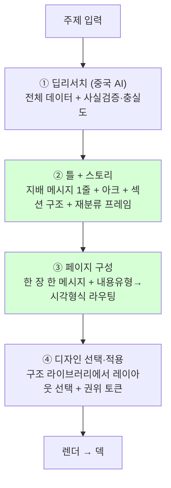

# TickDeck — 컨설팅 덱 구조 라이브러리 (역분석 학습본)

> 2026-06-19 · 실제 컨설팅 덱 3종 역분석으로 추출. 이게 자동 "리서치→덱" 파이프라인의 **정본 flow + ④디자인 단계 vocabulary**다.
> 레퍼런스: 삼일PwC CES 2026 (58p) · Deloitte Tech Trends 2025 (16p) · 삼정KPMG Agentic AI Gateway (11p)
> ⚠️ 학습 대상 = **구조·라우팅 로직**. 각 펌의 브랜드 스킨(색·로고)은 베끼지 않음 — 디자인 토큰은 후추님 것.

## ★ 작가 원칙 (확정 · 2026-06-19 · 5렌즈+코덱스 교정)

> 첫 마케팅 덱 시제품 → 후추님 7개 지적 → 컨설팅/기획/CEO/적대 4 렌즈 + 코덱스 구현 렌즈로 교정. **이게 ②③ 작가의 SoT.** (A) 자동화 시 코드 게이트의 씨앗.

1. **관통 질문으로 연다.** 트렌드 주제면 트렌드가 본문(시장 규모는 *그 트렌드의 근거*일 때만 본문). 첫 3장에 덱이 답할 질문 1개 + 긴장(통념→균열). 용어 첫 등장 시 한 줄 풀이.
2. **헤드라인 = 액션 타이틀(주장문).** 콘텐츠 제목은 라벨("시장 규모")이 아니라 서술어 있는 주장("시장은 3년 내 절반이 교체된다"). 제목만 읽어도 논증이 흐른다. 간지·목차만 질문/테마 허용. ← 옛 "명사구/질문형" 헤드라인 룰을 대체.
3. **한 장 = 주장 → 근거(출처 인라인) → 함의(so-what).** 슬라이드끼리 이 실로 잇는다.
4. **종합하되 평균하지 마라.** 정의 같은 수치만 묶는다. 이질적이면 범위(저-중-고)+왜 갈리는지, 또는 anchor 출처 1개 명시. 평균 빅넘버 금지(존재하지 않는 수·가짜 정밀).
5. **출처는 자리만 옮긴다, 숨기지 않는다.** 헤드라인 주어로 기관명 X(자기 목소리). 단 수치 옆 인라인 [n] + 슬라이드 footer에 출처 상시 노출.
6. **한 데이터셋 = 한 출처.** cherry-pick 금지. 교차검증 출처는 주석 병기 OK.
7. **표면 1메시지, 깊이는 본문에 절제.** 헤드라인 한 줄 주장 + 본문은 무엇·왜만 절제(어떻게=부록). 과밀 vs 빈약 충돌 시 덜어내기 우선. (발표자 없는 읽는 덱 = 노트 대신 본문 절제.)
8. **불확실성·약점을 드러낸다.** 추정 범위·기관 차이·데이터 시점·한계·반대 증거 노출. '사실만' 신뢰의 원천.
9. **착지 = so-what + 행동.** "그래서 무엇을·언제까지". 사실(데이터) vs 해석(우리 판단) 시각 구분.

> **(A) 자동화 게이트(코덱스 설계):** 정의 동질성 체크 · 인라인 [n] 누락 BLOCK · 액션타이틀 서술어 체크 · claim→evidence→so-what 필수 · 불확실성 누락 BLOCK.
> **즉시 버그 2:** `deck_author.py` 중국모델 잔재 정리 / 바인더 '외 N건' 축약이 근거 추적 사슬을 끊음 → slides.json에 `evidence_ids` 병행 보존.

## ★★ 학습 레이아웃 라이브러리 (5덱 분석 · 2026-06-19)

> 후추님 제공 5덱(메조미디어 트렌드·삼일PwC 산업전망 76p·KPMG WEF/웰니스/자동차) 병렬 분석 → 중복 제거. 약 45개 raw → **17 골격**. **수렴(여러 덱 독립 출현) = 강한 신호.** KPMG 작은 폰트는 구조만 차용·항목 수 줄이고 폰트 키움(전 에이전트 합의).

**아키텍처 결론(만장일치): "공통 셸 1개 + 본문 모듈 N종".** 섹션라벨→제목→리드 + 하단 출처/로고/페이지 = 셸 컴포넌트로 박고, 본문 영역만 모듈 슬롯으로 갈아끼운다. 자동 조립에 최적.

| 골격 | 담는 내용 | 수렴 | 상태 | 우선 |
|---|---|---|---|---|
| A 공통 셸(헤더+푸터) | 모든 본문 베이스 | 5/5 | footer 추가됨 | P0 베이스 |
| B 좌해설 1/3 + 우비주얼 2/3 마스터 | 한 줄 결론 + 차트/표 | 4덱 | 신규 | P0 |
| C N단계 진화 타임라인(가로 노드+화살표) | 시간·진화·단계 | 4덱 | iter1 빌드 | P0 |
| D 좌우 2상태 대비(중앙축/화살표) | before→after·A vs B | 5덱 | 보유·강화 | P0 |
| E 비교 매트릭스 표(좌 다크 스파인) | 다축 비교(행=기준·열=대상) | 4덱 | 보유·변형 | P0 |
| F N열 비교 카드(번호배지+불릿) | 병렬 N개 | 4덱 | 보유(3-card)·N열 확장 | P0 |
| G 결론 종합(주제→이슈→시사점 / 3축 / 3컬럼 권고) | 결론·Key Takeaways | 3덱 | iter1 빌드 | P0 |
| H 콤보 차트(막대+꺾은선 이중축) | 규모+추세 | 3덱 | 신규(차트) | P1 |
| I 듀얼/멀티 차트 패널 | 두 지표 한눈 | 3덱 | 신규(차트) | P1 |
| J 지표 대시보드 그리드(2×2 빅넘버 KPI) | 핵심 숫자 요약 | 2덱 | 보유·확장 | P1 |
| K 누적막대 시계열 / 빅넘버+Δ | 시계열 구성·성장 | 3덱 | 신규(차트) | P1 |
| L 도넛/파이 비중(외곽 라벨) | 점유·구성비 | auto | 신규(차트) | P1 |
| M 좌 라벨 × 우 상세(범주→세부) | 분류별 상세 | 2덱 | 신규 | P2 |
| N 프로세스/관계 도식(원형 플로우·정책→파급·A+B=C·동심원) | 관계·인과·생태계 | 3덱 | 신규 | P2 |
| O 2×2 포지셔닝 매트릭스(사분면) | 2축 상 위치 | PwC | 신규 | P2 |
| P 랭킹(막대/로고 + 지표·해설) | Top-N 순위 | 3덱 | 신규 | P2 |
| Q 간트 로드맵 / 연대기 타임라인 표 | 일정·추진 경과 | PwC | 신규 | P3 |

**제외/보류:** 인물 인용 카드 스택(우리 트렌드덱엔 인용 적음)·지도 오버레이(에셋 의존)·treemap(JS 난도) — 필요 시 후순위.

**최대 공백 = 차트(H·I·J·K·L).** 지금 빅넘버 막대뿐 → 콤보·듀얼·시계열·도넛·게이지가 없다. **차트 엔진 = ECharts 확정**(헤드리스 Chrome 렌더·데이터 기반 자동 작도. 정적 PPTX/엔바토 템플릿은 손편집이라 자동화 불가 — 룩 참고로만).
- 차트 모듈(레퍼런스서 수렴): 빅넘버 KPI 콜아웃 + 차트 / 차트 + 우측 %-바 리스트 / 멀티 차트 비교 / 원형 % 분석 카드 / 도넛·게이지(반원) / 콤보(막대+꺾은선 이중축) / 누적막대 시계열 / 라인 추세.
- iter2b+2c 구현명: `chart_bar`(세로·가로·스택 막대), `chart_donut`, `chart_gauge`, `chart_line`, `chart_combo`, `chart_kpi` + `split_master` 우측 슬롯 `right_kind:"chart"`. 데이터는 page_specs `payload`에서만 받고, 색은 deck_harness theme token(`--chart-*`)을 따른다.

### 색·테마 원칙 (후추님 2026-06-19)
- **색 ≠ 고정 파랑.** 주제·산업·스토리에 맞춰 고른다 (식품·웰니스·친환경=그린 / 테크·핀테크=블루·잉크 / 소비재=웜톤 / 에너지·중공업=딥토널 …).
- **기본은 톤다운(절제·세련).** 네온·원색 X. vibrant 차트 레퍼런스는 *레이아웃·에너지* 참고로만, 색은 톤다운 버전으로 실행.
- **테마 = 주제 적응형 팔레트**(고정 1색 아님). 토픽 보고 어울리는 톤다운 팔레트 선택 → 차트는 그 안에서 카테고리 색 분배. 후추님 덱별 덮어쓰기 가능.
- 레이아웃·차트 **구조는 색과 무관** → 한 번 빌드, 팔레트만 교체.
- **팔레트 기반 = 펜톤 최근 뉴욕·런던 패션위크 컬러 중 차분·톤다운 계열의 베리에이션** (후추님 반복 강조 — 세련 기준. 임의 원색 선택 X). 시즌 톤다운 컬러에서 출발해 주제 적응 팔레트 세트를 구성. SoT 메모리 = `feedback_deck_palette_pantone.md`.
- iter2b+2c 토큰 세트: `TD_pantone_ink_light/dark`, `TD_pantone_green_light/dark`, `TD_pantone_warm_light/dark`. 마케팅 덱 기본값은 `TD_pantone_ink_light`; 덱별 `theme` 또는 build CLI `--theme`으로 교체한다.

### 작가 톤·보이스 학습원 (후추님 2026-06-19)
- Downloads 5개 덱은 레이아웃뿐 아니라 **글의 톤·보이스 학습원**. 별도 보이스 학습 패스(PwC·메조미디어 텍스트 추출) 완료 → 아래 가이드가 작가 보이스 SoT.

**컨설팅 보이스 가이드 (실문구 추출):**
- **제목 = 명사구** (8~20자·한 호흡). 감탄·빈 수식어(혁신적/압도적) X. 질문형은 인트로 1회만.
- **리드 = 정확히 3문장: 현상 → 이유/메커니즘 → 전망.** 미래 종결 `~전망입니다`/`~기대됩니다`/`~가능성`. 4문장 X.
- **톤**: 현재 단정(`~입니다`) · 미래 헤지 · **숫자로 말함**(76%·9,272만 대). 1인칭·구어(`~인 것 같습니다`)·이모지·느낌표 X.
- **출처**: 핵심 단일 통계 = `기관명은 ~예측합니다`(주어 승격·권위) / 대량 데이터 = 하단 캡션 `자료: 기관(연도)`. 본문 중간 괄호 출처 X. ← **작가 원칙 5 보강**(기관명 무조건 빼는 게 아니라 핵심 1개는 주어로).
- **섹션 열기** = 3문장 인트로 + `~살펴보겠습니다` 예고. **닫기 = So-what 번호 처방**(`1 ~확보 / 2 ~대응 / 3 ~강화`·동사 필요/확보/강화/선점/추진). 흐지부지(`~흥미롭습니다`) X.
- **은유·문학체 = 오프닝 1페이지 전용**(PwC '들어가며'식). 분석 본문은 건조하게.
- 원문 텍스트 재참조용 = `/tmp/mezzo.txt`·`/tmp/samil.txt`.

**후추님 문체 = 덱 작가 기본 레지스터 (mypdf/_톤분석_결과.md·_논리구조분석_2026-06-15.md · own 31개 실카운트):**
- **레지스터 = 개조식(~함/~임/~됨) + 명사 끊기** (후추님 명시 선호). 합니다체(메조미디어식) X. 개조식은 PwC 톤이기도 해 컨설팅 권위와 맞음. 미래는 `~전망`/`~기대`.
- **헤드라인 = 명사구** (후추님 + 컨설팅 둘 다 일치). 한 줄 한 메시지·평균 14자·불릿 중심.
- **시그니처**: 화살표(→) 인과 · `&`/하이픈 병렬 · 영문 고유명사 병기 (단 한·중·일 혼용 X — 한국어 자연스러움 QA 통과).
- **논리 골격 = 사업화형**: 시장 변화 → 문제/기회 → 비교(Before/After·경쟁) → 해결/모델 → 실행 → 효과/리스크/**다음 액션**. *시장에 오래 안 머물고 바로 실행 단위로 내림 · 운영 해상도 높음 · "왜 우리가" 먼저 증명.*
- **종합 = 컨설팅 구조·엄밀성을 후추님 개조식 레지스터로** = 덱 작가 보이스. (현 마케팅 덱은 합니다체 → 재작성 시 개조식 전환.)

### ★ 덱 논리 골격 = 후추님 "사업화형" (TickDeck 제1 사용자 = 후추님 · 엔진이 후추님처럼 짜야)
- **관통 골격**: 변화(시장/판) → 문제·기회 정의 → 비교(Before/After·경쟁/사례) → 해결안·모델 → **실행·운영 해상도** → 효과/리스크/**다음 액션**.
- **"사업화형" ≠ "자료조사형"**: 변화·트렌드에 오래 안 머물고 바로 *실행 단위*로 내림. 추상 비전보다 실행이 앞. 시장조사도 끝은 "연결 방안/액션".
- **운영 해상도 높음**: 프로세스·단계·비용·리스크·다음 액션 단위로 쪼갬. **"왜 우리가/왜 지금" 먼저 증명** · 장표 = 하나의 판단 단위(결론이 실행/제안으로).
- 적용: 트렌드 덱도 *나열로 끝내지 말고* → 함의 → **그래서 무엇을(실행·다음 액션)**으로 착지. 작가 원칙 9(so-what)를 전 골격으로 강화.
- → **덱 작가 DNA = 후추님 논리(틀) + 후추님 개조식(말투) + 컨설팅 엄밀성(구조·숫자·출처).**

### 한국어 자연스러움 QA (후추님 2026-06-19)
- AI 한국어 = **번역체(직역투) + 한·중·일·영 혼용**이 가장 큰 'AI 티'. 생성 후 검토 패스 필수.
- **기계 검출**: 한글 외 CJK(한자·일본어 가나)·불필요한 영어 grep → 플래그 (기존 한자 금지 룰 확장).
- **LLM 검토**: 번역체 → 자연 한국어 교정 (수동태 남발·"~에 대해"·"~를 통해"·"~을 가진다" 같은 직역투·어색한 어순 잡기).
- 영구 파이프라인 게이트. (A) 자동화에도 적용. 컨설팅 보이스 패스(자연 한국어로 쓰인 한국 덱 기준)와 맞물림.

### 타이포·일관성 원칙 (후추님 2026-06-19)
- **세련됨의 출처 = 색·장식이 아니라 타이포(폰트 + 글자 크기 위계) + 화면 구성(여백·정렬)의 일관 시스템.**
- **한 덱 = 하나의 타이포·구성 시스템에 전부 commit.** 이질적 슬라이드 하나 섞으면 그 한 장이 전체를 깬다 ("갑자기 하나 들어가면 안 멋있다 → 묶음으로 가야"). 레이아웃이 늘어도 잡탕 금지.
- 구현 = **타이포 스케일(제목/부제/본문/캡션 단계) + 여백 그리드를 토큰으로 1회 고정**, 전 레이아웃(공통 셸 포함)이 공유. 새 레이아웃은 이 스케일·그리드 위에서만 만든다.
- **구체 장치 (오렌지/크림 레퍼런스 시리즈 = 후추님 "세련됨" 기준):**
  ① 혼합웨이트 헤드라인 `[보통]+[볼드]+(회색 괄호절)` (예: "This Micro **Trend Is** *(Screaming)*") — 그레이 괄호 부제가 시그니처
  ② 거대 숫자 콜아웃 (311K·89%·188+)
  ③ 비대칭 좌텍스트/우비주얼 그리드 + 넉넉한 여백
  ④ 상단 nav + 하단 푸터 전 장 고정
  ⑤ 단색 강조 + 중립(블랙/크림) 라이트·다크 교차
  → **색보다 이 시스템이 먼저.** iter2 = 레이아웃 추가가 아니라 이 타이포·그리드 시스템을 까는 것.
- **★ 전 텍스트 스케일 통일 (후추님 강조 6/19):** 모든 텍스트 요소가 같은 타입 스케일 토큰을 쓴다 — 같은 위계 = 어디서든 같은 크기·굵기. 스케일을 *일부만* 키우고 캡션·라벨·출처줄이 작고 얇게 남으면 그 **섞임**이 제일 산만(=AI 티). 위계 점프는 정의된 단계(display→h1→h2→body→caption)만, 중간 크기 난립·rogue 하드코딩 사이즈 0. QA에서 픽셀로 통일 확인.

## 0. 정본 FLOW (역분석으로 확증됨)

②③이 기존 gstack 계획(리서치→양식매칭→렌더)에서 통째로 빠졌던 "발표 작가" 단계.

## 1. ② 틀+스토리 — 3덱 공통 법칙

- **지배 메시지(governing thought) 1줄을 먼저 박는다.** 표지·요약·결론에 같은 문장을 3~4회 반복(수미상관). 덱 응집력 = 슬라이드 합이 아니라 한 문장의 메아리.
  - CES="Tech Touch(기술이 감성을 터치)" 4회 · Deloitte="Breadth is the New Depth" 3회 · KPMG="모델 수가 아니라 통제 인프라가 승부처" thesis 고정.
- **스토리 아크**: 현재→전개→결론(Deloitte) / 문제→진단→해법(프레임워크)→증명(사례)→실행(KPMG) / 메가테마→하위 N개 분해→종합(CES).
- **자체 재분류 프레임 = 차별화의 핵심.** 원시 항목을 그대로 안 쓰고 "우리 렌즈"로 5±2 테마로 재범주화. 원분류 병기 + "○○가 재분류" 각주로 *베낀 게 아니라 해석한 것*임을 못박음.
- 큰 덱은 **3계층 번호 + (N/M) 진행도 카운터**로 길 안내(챕터→테마→진행도). 성숙도 낮은 테마는 페이지 예산 축소.

## 2. ③ 페이지 구성 — 한 장 한 메시지 + 라우팅

- **헤드라인 이원 구조**: (상단) 섹션 네비 태그 `2-1 AI, Everything (1/5)` + (본문) 큰 제목. 제목은 **명사구 or 질문형**(질문형이 트렌드 전개 엔진: "CES 2026, 주목할 기업은?").
- **결론 먼저(BLUF/takeaway-first)**: 헤드라인 바로 아래 ■불릿 2~4개로 그 페이지 결론을 먼저 요약 → 그다음 근거(도식·표·카드). `→` 화살표로 함의 도출.
- **테마 × 고정 질문 템플릿의 곱(matrix)으로 페이지 양산**: CES는 5테마 전부 "개념→대기업→스타트업→수상작" 4질문 동일 시퀀스. 다른 내용을 같은 골격에 흘려넣음.

### ★ 내용유형 → 시각형식 라우팅 표 (③의 알고리즘 핵심)
| 내용 유형 | 시각 형식 |
|---|---|
| 시간 흐름·진화 | **타임라인 / 연도×항목 매트릭스 / N단계 진화(모티프 모핑)** ← 스크린샷 예시 |
| 개념 관계·융합 | 박스+`+`/`→` 흐름 도식 · 동심원 생태계도 |
| 점진적 전환·단계 | 깔때기(funnel) · Step 1~4 세로 흐름 |
| 여러 항목 한눈 비교 | **표**(헤더 음영 + zebra) |
| 정량 전망·규모 | 막대+꺾은선 **CAGR 차트** |
| 제품·항목 나열 | **카드 그리드(4열)**(이미지+명칭+1~2불릿) |
| 기업 사례 비교 | **2×2 박스**(로고+사진+불릿) |
| before/after | **색 대비**(회색=현재, 강조색=미래) |
| 미래·관계·전망 | 글 대신 **개념 다이어그램**(사이클·위성·삼각) |
- **도식 남발 금지**: KPMG는 11p에 핵심 도식 1·표 1만. "꼭 필요한 1축"에만.

## 3. ④ 디자인 — 구조 라이브러리 + 권위 토큰

### 학습한 재사용 레이아웃 구조 (deck_harness에 구현할 vocabulary)
1. 풀블리드 표지 (이미지+지배 메시지)
2. 챕터 간지 (풀블리드 + 거대 숫자 01~04 + 세리프 제목)
3. 목차 (테마 영문 슬로건 미리 노출)
4. **N단계 진화 타임라인** (2024→2025→2026, 반복 모티프가 단계마다 성장/연결) ← 후추님 지목 구조
5. 동심원 생태계도 / 깔때기 / 박스+화살표 흐름 도식
6. 좌 현황 / 우 전망 마스터 (Deloitte 본론 템플릿)
7. takeaway-first: 헤드라인 + ■결론불릿 + 근거블록
8. 카드 그리드(4열) / 2×2 기업 비교
9. 빅넘버·CAGR 차트
10. 정형 표(헤더 음영) / 3축 매트릭스(KPMG 3C)
11. 결론 종합 도식(전체를 한 그림에 봉합·순환 루프)
12. 백표지(로고+면책+문서번호)

### 전 페이지 강제 "권위 토큰" (이게 컨설팅 급 신호)
- 페이지 하단 **출처 한 줄**(`자료: …, ○○경영연구원`) — 자체 도식도 출처 명시
- 전문용어 **번호 각주 풀이** + 한글 개념 **영어 병기**(SDV¹⁾, 명확성(Clarity))
- 모든 페이지 **푸터(브랜드+페이지번호)** + 섹션 네비 태그
- **색 의미 코딩 고정**(강조색=우리/미래, 회색=중립/현재)
- 세리프(제목) ↔ 산세리프(본문) 이원 타이포
- 백표지 면책·문서번호로 "공식 발행물" 닫음

### ④ 디자인 벤치마크 — 수집 보류 (2026-06-19)
- 후추님 관찰: **디자인 완성도는 KPMG가 가장 낫다.** ← ④ 디자인 토큰의 기준 펌으로 삼는다.
- 단 수집은 **②③ 작가 단계 빌드 + 첫 렌더 이후**로 미룬다. 지금 더 모으면 아직 못 쓰는 어휘만 쌓임 (구조는 3덱으로 이미 충분).
- 그때 KPMG 2~3개를 **타겟** 수집 = 구조 말고 그리드·여백·타이포·색 규율만 뽑아 ④에 입힌다.

## 4. 3덱 공통 핵심 (자동 파이프라인 필수 학습)
1. **지배 메시지 먼저 고정 → 전부 그걸 증명·반복.** 첫 출력은 슬라이드가 아니라 "덱 한 줄 + 그걸 분해한 5±2 슬로건".
2. **내용유형→시각형식 라우팅이 ③의 알고리즘.** "불릿로 다 채우기"가 아니라 데이터 모양 보고 그릇을 고름. 미래·관계는 글이 아니라 그림.
3. **출처 신뢰 + 자체 재해석을 페이지 단위 강제 필드로.** (a)모든 클레임 출처 슬롯 (b)원분류 보존+재범주화 라벨 → "베낀 게 아니라 해석".

## 5. 기존 자산과의 연결
- `axis2_layouts/components/manifest.json`(content_kind→layout 매핑)을 **이 라우팅 표 기준으로 재작성**.
- `deck_harness`에 4·5·6·11번 구조(진화 타임라인·생태계도·좌우 마스터·결론 종합 도식)가 없으면 신규 구현.
- 현재 `axis1_to_deck.py`(기계적 슬라이서)는 ②③ 없이 ④로 직행 — 이게 결함. ②③ "발표 작가" 단계 신설이 다음 작업.
